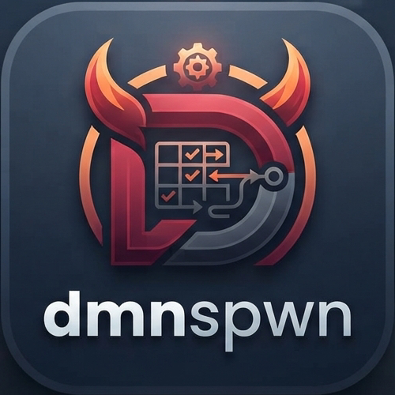
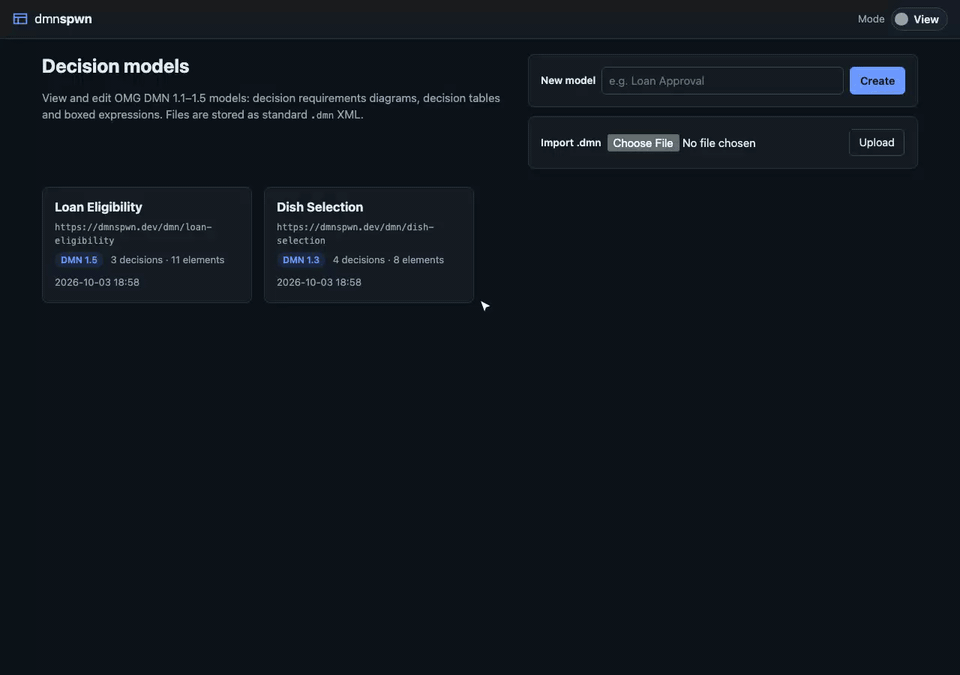

<p align="center"></p>

# dmnspwn

A browser-based viewer, editor, evaluator and test bench for OMG **Decision Model and Notation** (DMN 1.1 – 1.5)
models. Open a `.dmn` file, see its decision requirements diagram and boxed expressions, change it, run it against
input values, and keep the results as regression tests that re-run on every edit.

Everything is rendered on the server (Java 21, Spring Boot, Thymeleaf), so there is no front-end build and the
whole UI works with plain HTML forms. The only JavaScript is optional progressive enhancement: drag-and-drop on
the diagram in edit mode, and jumping to a result from the evaluation diagram.



**Try it:** `mvn spring-boot:run` and open <http://localhost:8080>. Two sample models (*Dish Selection* and
*Loan Eligibility*) are loaded on first start. See [Getting started](#getting-started) for other ways to run it.

## A typical session

The demo above follows this loop:

1. **Browse** – open a model from the home page; its decision requirements diagram (DRD) is drawn with full DMN
   notation. Click any element to see its logic: a decision table, a literal expression, a context, and so on.
2. **Evaluate** – on the *Evaluate* tab enter values for the input data as FEEL expressions (`8`, `"Fall"`,
   `true`, `[1, 2, 3]`, `{amount: 100000}`) and run. Every decision's result is shown, along with the
   decision-table rules that matched, and the values are drawn onto the DRD.
3. **Save as test** – keep those inputs and results as a test scenario.
4. **Edit** – switch to *Edit* mode and change a rule. The *Tests* tab badge immediately shows that a scenario
   now fails; open it to see expected vs. actual values and which decisions diverged.
5. **Accept or fix** – either undo the change, or accept the new results as the expected values.
6. **Validate** – check the model for structural problems before downloading or publishing it.

## Features

### Decision requirements diagrams

- Rendered on the server as SVG with the DMN notation: decisions, input data, business knowledge models,
  knowledge sources, decision services (with output/encapsulated divider) and text annotations; information,
  knowledge and authority requirements and associations.
- Uses the model's DMNDI layout when present, including models with several DRDs; otherwise an automatic layered
  layout is computed.
- Standalone SVG export of any diagram.

### Boxed expressions

Every DMN boxed expression type is displayed in its standard tabular form:

- decision tables, with hit policy notation, input/output values, rule annotations and aggregation
- literal expressions, contexts, relations, lists, invocations and function definitions
- the DMN 1.4+ expressions: conditional (`if`), iterators (`for` / `some` / `every`) and filter

### Editing

Toggle *View / Edit* in the header. All edits are undoable.

- **Elements** – add, rename and delete elements. Requirements are created according to the DMN connection rules,
  with duplicate and cycle checks.
- **Diagram** – drag shapes to move them and Shift+drag between shapes to connect them, or use the equivalent
  HTML forms; add or remove elements from a DRD, or re-run the automatic layout.
- **Decision tables** – a full editor for hit policy, aggregation, inputs, outputs and annotation columns, and for
  rules: insert, duplicate, reorder and delete.
- **Other logic** – a literal expression editor, and an XML editor for any other boxed expression type.
- **Structure** – BKM parameters, decision service membership, and item definitions including nested components.
- **Whole model** – edit the XML source directly, step back through the undo history, or convert an older model to
  DMN 1.5.

Edits are applied to the XML document in place, so vendor extensions, unknown attributes and comments survive a
round trip.

### Evaluation

The *Evaluate* tab (or *Evaluate* on a single decision) runs decisions for input values written as FEEL
expressions. Nothing is written to the model.

- Shows each decision's result, any warnings or errors, and the decision-table rules that matched.
- Evaluates decision tables (all hit policies and aggregations), literal expressions, contexts, relations, lists,
  invocations, function definitions, conditionals, iterators and filters. BKMs and decision services can be
  called as functions.
- Values are checked against their declared types: input data, decision results, decision table input/output
  clauses (including input and output values), context entries, relation columns, invocation arguments and BKM
  parameters. Item definitions are followed through allowed values, type constraints, collections and structures,
  with DMN's implicit conversions (singleton lists, date to date and time). A value that does not conform is
  reported and becomes `null`; a decision table whose inputs do not conform is not evaluated.
- An optional ad-hoc FEEL expression can refer to any input, decision, BKM or decision service by name — handy for
  probing a model without changing it.
- Results are drawn on the DRD: every input and evaluated decision shows its value, errors and warnings are
  outlined, decisions that were not evaluated are dimmed, and the requirements the run used are highlighted.
  Clicking a decision jumps to its result and matched rules.

### Tests

- *Save as test* on the *Evaluate* tab stores the inputs and the current results of the evaluated decisions as a
  scenario.
- The *Tests* tab re-runs every scenario whenever the model changes and shows expected vs. actual values with the
  matched rules. The tab badge shows the number of failing tests on every page, so a regression is visible while
  you edit.
- A failing scenario can be opened in the evaluator, which marks the mismatching decisions on the DRD and shows
  their expected values — or its current results can be accepted as the new expected values.
- Scenarios use the [DMN TCK](https://github.com/dmn-tck/tck) test case format and can be downloaded, or imported
  from existing TCK files (decision test cases only).

### Validation

Reports duplicate ids, missing names, dangling references, illegal requirements, cycles, decision table shape
problems, unknown types and orphan DMNDI shapes.

### Model management

- Create an empty model, upload a `.dmn` file, or download the current version.
- Optionally **load models from and publish them to an S3 bucket**, with conflict detection so that someone
  else's published change is never silently overwritten (see [S3 loading and publishing](#loading-from-and-publishing-to-aws-s3)).
- Run as a single instance with models on disk, or as several instances sharing models in S3
  (see [Storage](#storage)).

---

## Getting started

Requires Java 21 and Maven.

```bash
mvn spring-boot:run          # http://localhost:8080
mvn test                     # unit + MockMvc tests
mvn package && java -jar target/dmnspwn-0.1.0-SNAPSHOT.jar
```

### Container image

The [Dockerfile](Dockerfile) builds an example image (non-root, UID 10001, port 8080; amd64 and arm64/Graviton),
e.g. for Amazon EKS:

```bash
docker build -t dmnspwn .
docker run -p 8080:8080 dmnspwn
```

Models are kept in `/app/dmn-models` inside the container; mount a volume there to keep them, or use
[S3 storage](#several-instances-s3-storage).

Behind a load balancer or ingress, `X-Forwarded-*` headers are honoured. Container probes are
`/actuator/health/liveness` and `/actuator/health/readiness`; no other actuator endpoints are exposed.

> **Security:** dmnspwn is intended as a local / trusted-network tool. It has no authentication or CSRF
> protection; add Spring Security (or an authenticating proxy) before exposing it more widely.

## Configuration

All settings are standard Spring Boot properties, so they can be set in `application.yml`, as command-line
arguments (`--dmnspwn.history-size=100`) or as environment variables (`DMNSPWN_HISTORY_SIZE=100`).

| Property | Default | Description |
|---|---|---|
| `dmnspwn.storage` | `file` | `file` (one instance) or `s3` (any number of instances) |
| `dmnspwn.storage-directory` | `./dmn-models` | where `file` storage keeps models |
| `dmnspwn.seed-samples` | `true` | copy the bundled sample models into an empty store |
| `dmnspwn.history-size` | `50` | previous versions kept per model for undo |
| `dmnspwn.s3.enabled` | `false` | turn on the S3 integration |
| `dmnspwn.s3.bucket` | | bucket name (required when enabled) |
| `dmnspwn.s3.prefix` | `dmn/` | where models are loaded from and published to |
| `dmnspwn.s3.storage-prefix` | `dmnspwn/` | where `storage: s3` keeps models; must not overlap `prefix` |
| `dmnspwn.s3.region` | SDK default | e.g. `eu-west-1` |
| `dmnspwn.s3.endpoint` | | endpoint override for S3-compatible stores, e.g. `http://localhost:9000` |
| `dmnspwn.s3.path-style` | `false` | path-style addressing (needed by most S3-compatible stores) |
| `dmnspwn.s3.max-object-size` | `10MB` | largest object that will be loaded |
| `dmnspwn.s3.timeout` | `30s` | overall timeout for one S3 API call |

Uploads are limited to 10 MB (`spring.servlet.multipart.max-file-size`).

## Storage

### Single instance (files)

By default models are stored as plain `.dmn` files in `dmnspwn.storage-directory`, with their test scenarios beside
them as `<id>.tests.xml`. The bundled samples are copied there on first start unless `seed-samples` is `false`.
Test scenarios are not part of undo history or S3 publishing.

### Several instances (S3 storage)

File storage suits a single instance. To run several (e.g. Kubernetes replicas), store the models in S3 instead, so
that no persistent volume is needed and every instance works on the same data:

```yaml
dmnspwn:
  storage: s3
  s3:
    enabled: true
    bucket: my-decision-models
    storage-prefix: dmnspwn/   # models, undo history and tests; must not overlap s3.prefix
```

```
dmnspwn/<id>.dmn                       the model
dmnspwn/<id>.tests.xml                 its test scenarios
dmnspwn/.history/<id>/<revision>.dmn   previous versions, for undo
dmnspwn/.meta/<id>.properties          the model's link to a published object
```

- Every change is a conditional write (`If-Match` on the ETag that was read, `If-None-Match: *` for a new model or
  test file). When another instance changed the model in the meantime, the change is applied again to the new
  version, so concurrent edits are never lost; after five attempts the user is asked to try again.
- Undo history is numbered by a revision counter kept in the model object's metadata, not by clocks.
- Contents are cached per instance and revalidated with a conditional GET, so a change made by any instance is
  seen on the next page load.
- Flash messages are kept in a cookie, so sticky sessions are not required. The evaluator remembers its last inputs
  in the HTTP session; without sticky sessions it may forget them when a request reaches another instance.
- Requires an S3 that supports conditional writes (AWS S3, MinIO) and the additional IAM action `s3:DeleteObject`
  on the storage prefix. Set `dmnspwn.seed-samples=false` unless an empty bucket should get the samples.

## Loading from and publishing to AWS S3

Independently of where models are stored, dmnspwn can import models from an S3 prefix and publish them back.
Disabled by default; enable it with configuration (or the matching `DMNSPWN_S3_*` environment variables):

```yaml
dmnspwn:
  s3:
    enabled: true
    bucket: my-decision-models
    prefix: dmn/           # loading and publishing only read and write keys under this prefix
    region: eu-west-1      # optional; defaults to the SDK region chain
    # endpoint: http://localhost:9000   # S3-compatible stores (MinIO, LocalStack)
    # path-style: true
```

Credentials come from the AWS SDK default provider chain (`AWS_*` environment variables, `~/.aws` profiles / SSO,
ECS task roles, EKS IRSA / Pod Identity, EC2 instance roles). Required IAM actions on the bucket/prefix:
`s3:ListBucket`, `s3:GetObject`, `s3:PutObject` (and `s3:DeleteObject` on the storage prefix with `storage: s3`).

- **Load from S3** (home page) browses the prefix and imports `.dmn` / `.xml` objects as local models.
- Each model gets an **S3** tab showing its linked object, whether the local copy or the S3 object changed since the
  last sync, and actions to **Publish**, **Pull** (replace local, undoable) and **Unlink**.
- Publishing uses S3 conditional writes: on the linked key it requires the ETag from the last sync (`If-Match`), on
  any other key it requires that no object exists (`If-None-Match: *`). A conflict is reported with an explicit
  *Overwrite* option instead of silently replacing someone else's change.
- Reloading an object never discards unpublished local edits.
- Enable bucket versioning if you want server-side history of published versions.

## Design notes

- The DOM is the source of truth (`xml.DmnDocument`). Edits mutate the DOM in place and insert children in XSD
  sequence order, so extension elements, vendor attributes and comments survive a round trip.
- Read-only view records (`model.Views`, `model.ExpressionView`) are built per request by `model.DmnReader` and
  rendered by Thymeleaf; recursive boxed expressions use a recursive fragment.
- XML parsing disables DTDs and external entities.
- FEEL is evaluated by the [FEEL Scala engine](https://github.com/camunda/feel-scala) (Apache 2.0; it brings the
  Scala runtime, Apache 2.0, and fastparse, MIT). It is used only for FEEL text; the boxed expressions and DRG
  wiring are interpreted in `eval.Interpreter` / `eval.ModelEvaluator`, with the engine's own values kept between
  steps so numbers stay decimal. DMN names may contain spaces (`Guest Count`), which the engine only accepts in
  backticks, so names known in the model are backtick-quoted before parsing.

### Limitations

- Imported elements (`dmn:import`) are not resolved during evaluation.
- Java and PMML function kinds are not executed.
- There is no authentication or CSRF protection (see [Security](#container-image)).

Specifications: <https://www.omg.org/spec/DMN>
